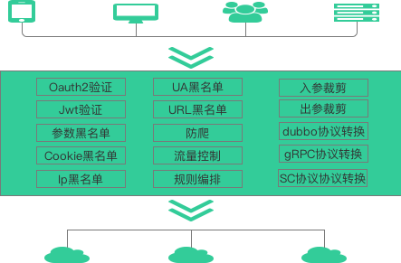
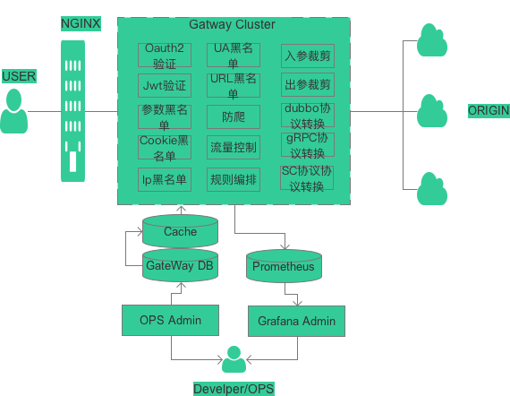
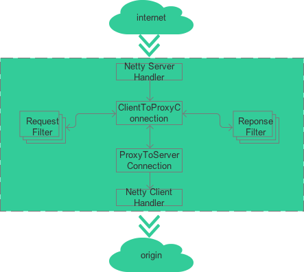

######引言
随着互联网的快速发展，当前以步入移动互联、物联网时代。用户访问系统入口也变得多种方式，由原来单一的PC客户端，变化到PC客户端、各种浏览器、手机移动端及智能终端等。同时系统之间大部分都不是单独运行，经常会涉及与其他系统对接、共享数据的需求。所以系统需要升级框架满足日新月异需求变化，支持业务发展，并将框架升级为微服务架构。“API网关”核心组件是架构用于满足此些需求
很多互联网平台已基于网关的设计思路，构建自身平台的API网关，国内主要有京东、携程、唯品会等，国外主要有Netflix、Amazon等。
######业界相关网关框架
业界为了满足这些需求，已有相关的网关框架。
1、基于nginx平台实现的网关有：kong、umbrella等
2、自研发的网关有：zuul1、zuul2等
但是以上网关框架只能是满足部分需求，不能满足企业的所有要求，就我而言，我认为最大的问题是没有协议转换及OPS管理控制平台
######网关概览

 

* 面向 Web 或者移动 App
这类场景，前端应用通过 API 调用后端服务，需要网关具有认证、鉴权、缓存、服务编排、监控告警等功能。
* 面向合作伙伴开放 API
这类场景，主要为了满足业务形态对外开放，与企业外部合作伙伴建立生态圈，此时的 API 网关注重安全认证、权限分级、流量管控、缓存等功能。
* 企业内部系统互联互通
这类场景，主要为了企业内部存在不同部门，而部门之间技术栈的不同，使用的通信协议或框架不同，需要一个通用的网关来支持内部系统互联及互通，此时API网关会更注重协议转换的功能，比如说gRPC和Dubbo的协议转换

另外：对于微服务架构下，如果基于HTTP REST传输协议，API网关还承担了一个内外API甄别的功能，只有在API网关上注册了的API还能是真正的对外API
######网关组成部分

 
 
整个网关系统由三个子系统组成：
1. GateWay Proxy：
负责接收客户端请求、执行过滤器、 路由请求到后端服务，并处理后端服务的请求结果返回给客户端
2. GateWay OPS：
提供统一的管理界面，开发人员可在此进行 API、定义过滤器及定义过滤器规则
3. GateWay Monitor：
主要由Prometheus来拉取GateWay Proxy的系统情况，由运维人员监控整个GateWay Proxy的健康状况及API统计情况
######网关技术架构

 

说明：
 1） 整个网关基于Netty NIO来实现同步非阻塞是HTTP服务，网关是外部API请求的HTTP服务端，同时是内部服务的客户端，所以有Netty Server Handler和Netty Client Handler的出现；
 2）对于Netty Server Handler来说，当一个HTTP请求进来时，他会把当前连接转化为ClientToProxyConnection，它是线程安全的，伴随当前此HTTP请求的生命周期结束，它也负责ClientToProxyConnection的生命周期的维护；
 3）对于Netty Client Handler来说，当ClientToProxyConnection需要传递请求到内部服务时，会新建(或者获取原来已建)的ProxyToServerConnection来进行内部的请求，它也是线程安全的；
 4）对于Filter来说，他运行在ClientToProxyConnection上，插入请求进来及收到后端请求之间；
######网关技术细节

*  网络IO模型：
网络模型可以分为阻塞IO、非阻塞IO、IO复用、信号驱动IO和异步IO
网络IO操作(read/write系统调用)其实分成了两个步骤：
第一：发起IO请求 ；第二：实际的IO读写(内核态与用户态的数据拷贝)
阻塞与非阻塞IO的区别在于第一步，发起IO请求的进程是否会被阻塞，如果阻塞直到IO操作完成才返回那么就是传统的阻塞IO，如果不阻塞，那么就是非阻塞IO；
同步IO和异步IO的区别在于第二步，实际的IO读写(内核态与用户态的数据拷贝)是否需要进程参与，如果需要进程参与则是同步IO，如果不需要进程参与就是异步IO；
如果实际的IO读写需要请求进程参与，那么就是同步IO。因此阻塞IO、非阻塞IO、IO复用、信号驱动IO都是同步IO
从以上来看HTTP请求是适合同步非阻塞的方式，一个HTTP请求必然有REQUEST和RESPONSE，而在zuul2上实现的真正网络IO也是同步非阻塞，只不过在HttpAsyncEndpoint这个Filter执行HTTP请求时采用了异步方式，如下：
```
 @Override
    public Observable<HttpResponseMessage> applyAsync(HttpRequestMessage input)
    {
        if (error != null) {
            return Observable.create(subscriber -> {
                Throwable t = new RuntimeException("Some error response problem.");
                subscriber.onError(t);
            });
        }
        else if (response != null) {
            return Observable.just(response);
        }
        else {
            return Observable.just(new HttpResponseMessageImpl(input.getContext(), input, 200));
        }
    }
```
从以上分析，网关选择同步非阻塞方式是一个合适的选择

*  协议转换
 1） HTTP ----> gRPC
  gRPC基于protobuf来做传输，所以整个在gRPC的客户端来说，必须有protobuf的数据来描述当前此次gRPC请求，而proto文件是一个合适的数据描述方式，[grpc-web](https://github.com/grpc/grpc-web) 也是如此来做http请求的转换
具体步骤是：
1） 将proto文件转化为protobuf的FileDescriptorSet对象，该对象描述了所有的proto内容，而转化也很简单，利用protobuf提供的命令即可转化，在这里我使用的是:
```
<dependency>
	<groupId>com.github.os72</groupId>
	<artifactId>protoc-jar</artifactId>
	<scope>provided</scope>
</dependency>
```
其中转化的过程如下：
```
 public FileDescriptorSet invoke() throws ProtocInvocationException {
    Path wellKnownTypesInclude;
    try {
      wellKnownTypesInclude = setupWellKnownTypes();
    } catch (IOException e) {
      throw new ProtocInvocationException("Unable to extract well known types", e);
    }

    Path descriptorPath;
    try {
      descriptorPath = Files.createTempFile("descriptor", ".pb.bin");
    } catch (IOException e) {
      throw new ProtocInvocationException("Unable to create temporary file", e);
    }

    ImmutableList<String> protocArgs = ImmutableList.<String>builder()
        .addAll(scanProtoFiles(discoveryRoot)).addAll(includePathArgs(wellKnownTypesInclude))
        .add("--descriptor_set_out=" + descriptorPath.toAbsolutePath().toString())
        .add("--include_imports").build();

    invokeBinary(protocArgs);

    try {
      return FileDescriptorSet.parseFrom(Files.readAllBytes(descriptorPath));
    } catch (IOException e) {
      throw new ProtocInvocationException("Unable to parse the generated descriptors", e);
    }
  }
```
2：根据FileDescriptorSet获取gRPC的入参和出参描述符，然后再创建gRPC所需要的MethodDescriptor方法描述对象

* 获取protobuf的MethodDescriptor来获取入参和出参的Descriptor
```
 private static Pair<Descriptor, Descriptor> findDirectyprotobuf(final ApiRpcDO rpcDo) {
    byte[] protoContent = rpcDo.getProtoContext();
    FileDescriptorSet descriptorSet = null;
    if (protoContent != null && protoContent.length > 0) {
      try {
        descriptorSet = FileDescriptorSet.parseFrom(protoContent);
        ServiceResolver serviceResolver = ServiceResolver.fromFileDescriptorSet(descriptorSet);
        ProtoMethodName protoMethodName = ProtoMethodName
            .parseFullGrpcMethodName(rpcDo.getServiceName() + "/" + rpcDo.getMethodName());
       //MethodDescriptor是protobuf的方法描述对象
        MethodDescriptor protoMethodDesc =
            serviceResolver.resolveServiceMethod(protoMethodName.getServiceName(),
                protoMethodName.getMethodName(), protoMethodName.getPackageName());
        return new ImmutablePair<Descriptor, Descriptor>(protoMethodDesc.getInputType(),
            protoMethodDesc.getOutputType());
      } catch (InvalidProtocolBufferException e) {
        LOG.error(e.getMessage(), e);
        throw new RuntimeException(e);
      }
    }
    return null;
  }
```
* 构建gRPC所需要的方法描述对象
```
private MethodDescriptor<DynamicMessage, DynamicMessage> createGrpcMethodDescriptor(
      String serviceName, String methodName, Descriptor inPutType, Descriptor outPutType) {
    String fullMethodName = MethodDescriptor.generateFullMethodName(serviceName, methodName);
    //MethodDescriptor是grpc的方法描述对象
    return io.grpc.MethodDescriptor.<DynamicMessage, DynamicMessage>newBuilder()
        .setType(MethodType.UNARY)//
        .setFullMethodName(fullMethodName)//
        .setRequestMarshaller(new DynamicMessageMarshaller(inPutType))//
        .setResponseMarshaller(new DynamicMessageMarshaller(outPutType))//
        .setSafe(false)//
        .setIdempotent(false)//
        .build();
  }
```
 2） HTTP ----> dubbo
在dubbo的框架设计中，其中已经包含了泛化调用的设计，所以在这块，基本上就延用了dubbo的泛化调用来实现http转dubbo的协议

*  参数裁剪
 利用了[JsonPath](https://github.com/json-path/JsonPath) jsonPath及Freemarker模板可以实现参数裁剪的效果，其设计思路可以参照，[amazon的做法](https://docs.aws.amazon.com/zh_cn/apigateway/latest/developerguide/api-gateway-mapping-template-reference.html)，实现效果如下：
```
<#assign json = input.path("$")>
[
    {
      "name": "${json.name}",
	  "mobile": "${json.mobile}",
	  "idNo": "${json.idNo}"
    }
]
```
* API规则编排
利用了Drools的drl语言，把这块给了他实现

######结束语
整个网关目前基本完成并且也开源到GitHub上，欢迎拍砖及使用
[tesla](https://github.com/linking12/tesla)
